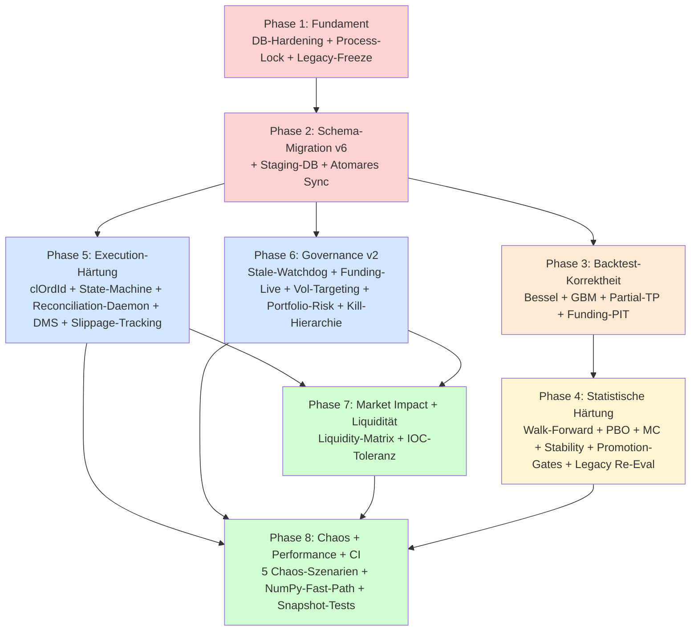

# APEX-V2 — V6 Implementation Plan

> **Plan-Mode-Hinweis:** Diese Datei ist der Plan-Mode-Output. Nach Approval wird der Inhalt **identisch nach `research/state/v6-implementation-plan.md` kopiert** (wie in `research/briefs/v6-upgrade-protocol.md` Teil H gefordert) und dient dann als verbindliche Implementierungs-Referenz.

---

## Context

**Warum dieser Plan existiert.** Das Quant-Trading-System APEX-V2 ist live (1 archivierter Bot ORB, mehrere Strategien in Shadow/Dry-Run). Der `v6-upgrade-protocol.md`-Brief identifiziert **17 OPEN-Punkte** in vier Schwächeklassen:

1. **Kritische Backtest-Verzerrungen** (Bessel-Korrektur, Exit-Priorität, fehlende Partial-TP-Simulation, statisches Funding) → alle bisherigen `lab_discoveries` sind statistisch unzuverlässig.
2. **Statistische Härtung fehlt** (kein Walk-Forward mit Purge/Embargo, kein PBO, keine Monte-Carlo, keine Parameter-Stabilität, keine echten DSR/MaxDD-Hard-Gates) → Overfitting-Risiko hoch.
3. **Execution-Idempotenz unvollständig** (`clOrdId` wird NACH API-Call gesetzt, kein Reconciliation-Daemon, kein Dead-Man's-Switch, Slippage/Funding-Live nicht getrackt).
4. **Governance-Lücken** (kein Stale-Data-Watchdog im Gate, keine Portfolio-Exposure-Engine, keine Funding-Rate-Live-Bewertung, kein Volatility-Targeting).

**Intendiertes Ergebnis.** Nach Abschluss aller 8 Phasen:
- Backtest = Live (bit-genau, inkl. Partial-TP, Point-in-Time-Funding, Intrabar-Pfad)
- Promotion nur mit DSR ≥ 0.50, PBO ≤ 0.30, MaxDD ≤ 30%, Stability ≥ Schwelle (alle Hard-Gates)
- Executor 100 % idempotent (Pre-API-`clOrdId`), separater Reconciliation- und DMS-Daemon
- Governance prüft Stale-Data, Funding, Portfolio-Risk, Korrelations-Exposure
- Live-Geld bleibt während des gesamten Upgrades unverändert geschützt (`RISK_USDT`/`MAX_LEVERAGE`/`DRAWDOWN_KILL_PCT` werden NICHT angefasst).

---

## Status-Übersicht (DONE / PARTIAL / OPEN pro v6-Item)

### Teil A — Backtest- und Logikfehler
| ID | Item | Status | Evidence |
|----|------|--------|----------|
| A.1 | Exit-Priorität statisch + kein GBM | **OPEN** | `backtest/engine.py:137-169` if/elif/else SL>TP2>TP1, kein 1m-Zoom, kein GBM |
| A.2 | Partial-TP fehlt im Backtest | **OPEN (kritisch)** | `BtTrade` in `backtest/models.py:24-36` ohne `tp1_hit`/`remaining_size`; Live hat 50%-Exit + BE in `monitor/position_monitor.py:98-156` → **Backtest/Live-Asymmetrie** |
| A.3 | Strategien-Parität (TP1=TP2 in squeeze/asian_fade) | **PARTIAL** | `_squeeze_signal` engine.py:373 TP1=TP2; `_asian_fade_signal` engine.py:439 TP1=TP2; `_vaa_signal`/`_kdt_signal` hartcodiert short |
| A.4 | Bessel-Korrektur in stdev() | **OPEN** | `features/indicators.py:40` `variance = ... / period` (Populationsformel) — wirkt auf Bollinger, Squeeze, Mean-Reversion |
| A.5 | Promotion-Gates (DSR/PBO/MaxDD) | **PARTIAL** | DSR berechnet (`auto_lab_daemon.py:996-1050`), aber kein Hard-Gate; PBO/Stability/Calmar fehlen vollständig |
| A.6 | Stale-Data Watchdog im Governance Gate | **PARTIAL** | Existiert in `scripts/run_features.py:49-55` (`_STALE_CANDLE_MINUTES=15`), aber NICHT im `GovernanceGate.evaluate()` |

### Teil B — Architektur
| ID | Item | Status | Evidence |
|----|------|--------|----------|
| B.2 | SQLite Hardening + Staging-DB | **PARTIAL** | `core/db.py:198-205` setzt WAL+busy_timeout; **fehlt:** `isolation_level="IMMEDIATE"`, `synchronous=NORMAL`. `scripts/lab_safety_bridge.py:66-69` nutzt rohes `sqlite3.connect()`. **Keine Staging-Sidecar-DB** |
| B.3 | Walk-Forward + Overfitting | **PARTIAL** | 3-Fenster-Validation in `auto_lab_daemon.py:88-102` vorhanden, **aber kein Purge, kein Embargo**, kein PBO |
| B.4 | Governance Gate (Korrelation, Funding, Stale) | **PARTIAL** | 8 Checks in `scripts/run_governance.py:18-60` registriert (DD, Regime, Sizing, Session, CrossAsset, HMM); fehlen: Portfolio-Risk, Korrelations-Limits, Funding, Stale |
| B.5 | Executor + deterministische clOrdId | **PARTIAL** | Retry-Backoff vorhanden (`bitget_client.py:112-125`); **`order_id` wird NACH API-Call gesetzt** (`executor.py:346`), kein `clientOrderId` im Body; Signal hängt auf `processing` bei Exception (`executor.py:222-225`) |
| B.6 | Constant Volatility Targeting | **OPEN** | `strategies/generic_deployed.py:184` nutzt `RISK_USDT / sl_dist`, keine ATR-Skalierung, kein Regime-Multiplikator |
| B.7 | CI/CD + Chaos | **PARTIAL** | GitHub Actions (`.github/workflows/test-gate.yml`) vorhanden mit pytest+parity+governance; **keine Docker-Sandbox, kein Chaos-Engineering** |

### Teil C — Quant-Grade-Erweiterungen
| ID | Item | Status |
|----|------|--------|
| C.1 | Purged/Embargoed CV + Zero-Leakage Feature-Puffer | **OPEN** |
| C.2 | CPCV/CSCV | **OPEN** (optional) |
| C.3 | DSR Hard-Gate | **PARTIAL** (Wert vorhanden, kein Gate) |
| C.4 | PBO | **OPEN** |
| C.5 | Monte-Carlo-Permutationen | **OPEN** |
| C.6 | Parameter-Stabilitäts-Checks | **OPEN** |
| C.7 | Composite Score | **PARTIAL** (`micro_score` ähnlich, `composite_score`-Feld fehlt) |
| C.8 | Portfolio-Exposure-Engine | **OPEN** (nur OpenRisk vorhanden) |
| C.9 | Kill-Switch-Hierarchie (4 Stufen) | **PARTIAL** (nur Soft-Kill via DrawdownKillCheck) |
| C.10 | Execution State Machine | **PARTIAL** (`approved→processing→executed`, kein `created/sent/acked/cancel_pending`) |
| C.11 | Order-Reconciliation | **OPEN** |
| C.12 | Research/Live-Datentrennung | **OPEN** (eine DB für alles) |
| C.13 | Autonomer Reconciliation Daemon | **OPEN** |
| C.14 | Implementation Shortfall / Slippage Tracking | **OPEN** (keine Slippage-Spalten in `trades`) |
| C.15 | Dynamic Funding Reconciliation | **OPEN** (kein `funding_rates`-Table) |
| C.16 | Market Impact Guard + IOC-Matrix | **OPEN** (kein `asset_liquidity_metrics`-Table) |
| C.17 | Funding Rate als Live-Governance-Signal | **OPEN** |
| C.18 | Chaos Engineering in CI/CD | **OPEN** |
| C.19 | Dead Man's Switch | **OPEN** |
| C.20 | Atomares Staging-Protokoll | **OPEN** |

### Teil D — Legacy-Reset
| ID | Item | Status |
|----|------|--------|
| D.1 | Framework-Diskontinuität dokumentiert | bestätigt |
| D.2 | Kontrollierter Schnitt (freeze→upgrade→re-eval) | geplant in Phase 1 (Freeze) + Phase 4 (Re-Eval) |
| D.3 | Schema-Migration v6 (alle Spalten) | **9** Spalten fehlen in `lab_discoveries`, **10** in `trades`, **0** in `signals` (reject_reason existiert), **2** neue Tabellen fehlen |

### Teil E — Repo-spezifisch
| ID | Item | Status |
|----|------|--------|
| E.1/E.2 | lab_safety_bridge — Connection-Hygiene | **PARTIAL** (rohes `sqlite3.connect`, kein Context-Manager) |
| E.3 | indicators.py Performance | **PARTIAL** (funktional ok, NumPy-Fast-Path optional) |
| E.4 | Scripts-Kopplung | **PARTIAL** (Master-Run vorhanden, dünne Verträge fehlen) |
| E.5 | settings.py — 11 v6-Konstanten fehlen | **OPEN** |

---

## Dependency-Graph (Mermaid)



**Kritischer Pfad:** P1 → P2 → P3 → P4 (Backtest+Stats vor Re-Eval). P5/P6 können parallel zu P3/P4 starten, sobald P2 abgeschlossen ist (Schema vorhanden). P7/P8 sind Konsolidierungs-Phasen.

---

## Phasen-Plan (Phase 1–8)

> **Pflichtregeln (gelten für jede Phase):**
> - Keine Änderung an `RISK_USDT`, `MAX_LEVERAGE`, `DRAWDOWN_KILL_PCT` (Hard Rule #5).
> - Keine Änderung an `execution/executor.py` ohne explizite User-Freigabe pro Phase (Hard Rule #1) — Phase 5 verlangt explizite Freigabe.
> - Vor jeder Phase: DB-Backup nach `data/backups/` mit Datums-Suffix (Hard Rule #4).
> - Nach jeder Phase: `pytest tests/`, `tests/parity_test.py`, `tests/governance_invariants.py`, `scripts/dry_run_smoke.py` GRÜN.
> - Promotionen während Upgrade pausiert (Legacy-Freeze aus Phase 1).

---

### Phase 1 — Fundament: DB-Hardening + Process-Lock + Legacy-Freeze

**Ziel.** Sicheres Fundament, bevor Schema oder Logik angefasst werden. Alle Schreib-Pfade auf gehärtete Connections; Legacy-Strategien einfrieren, damit nichts aus altem Framework promotet wird.

**Betroffene Dateien:**
- `core/db.py` — `get_connection()` (Z. 198-205) erweitern um `isolation_level="IMMEDIATE"`, `PRAGMA synchronous=NORMAL`. Neue Funktion `get_readonly_connection(uri_path)` für Research-Daemons.
- `scripts/lab_safety_bridge.py:66-69` — rohes `sqlite3.connect()` ersetzen durch `core.db.get_connection()`.
- `core/process_lock.py` (neu) — Datei-Lock via `fcntl.flock()` für Daemons; Heartbeat-Datei in `data/heartbeats/${component}.hb`.
- `scripts/run_strategies.py`, `scripts/run_governance.py`, `scripts/run_execution.py`, `scripts/run_intake.py`, `scripts/run_features.py`, `research/auto_lab_daemon.py`, `monitor/telegram_bot.py`, `monitor/heartbeat.py` — Process-Lock + Heartbeat-Datei-Write integrieren.
- `scripts/freeze_legacy_strategies.py` (neu, oneshot) — setzt `active_deployments.mode='shadow'` und `lab_discoveries.deployment_status='frozen'` für alle Einträge, die nicht `framework_version='v6'` haben (Spalte wird in Phase 2 hinzugefügt, hier nur via Komment vorbereitet — ein-Spalten-Migration ad-hoc).

**Reuse:** `core.db.get_connection()` ist bereits Standard außerhalb der lab_safety_bridge. Heartbeat-Tabelle existiert (`monitor/heartbeat.py:73-80`) — neu ist nur die parallele Datei-Heartbeat für den DMS in Phase 5.

**Tests:**
- Unit: `tests/test_db_hardening.py` (neu) — Parallel-Schreib-Test mit 5 Threads, kein `database is locked`-Error.
- Unit: `tests/test_process_lock.py` (neu) — zweiter Daemon-Start scheitert mit klarer Meldung.
- Integration: `scripts/dry_run_smoke.py` muss komplett grün durchlaufen.
- Manuell: `python scripts/freeze_legacy_strategies.py --dry-run` zeigt geplante Updates.

**Rollback.**
- `core/db.py` via Git revert.
- Legacy-Freeze: SQL `UPDATE active_deployments SET mode='dry_run' WHERE frozen_at IS NOT NULL;` (Spalte `frozen_at` als Audit-Marker).

**Aufwand.** ~2 Sessions.

---

### Phase 2 — Schema-Migration v6 + Staging-DB + Atomares Staging-Protokoll

**Ziel.** Alle v6-Spalten und neuen Tabellen sind in der Haupt-DB. Eine separate Staging-Sidecar-DB existiert; Research-Daemons schreiben Discoveries dort, ein Sync-Daemon promotet sie atomar mit Integritätsprüfung in die Haupt-DB.

**Betroffene Dateien:**
- `core/db.py:208-300` — `run_migrations()` um alle ALTERs aus Abschnitt "Schema-Migrationen" erweitern; neue Tabellen `funding_rates`, `asset_liquidity_metrics`, `execution_audit_log` anlegen; Unique-Index `idx_lab_disc_idempotent` erstellen.
- `core/db.py` (neu, oben) — Modul-Konstante `STAGING_DB_PATH = os.path.join(DATA_DIR, "research_staging.db")` + neue Funktion `get_staging_connection()`.
- `core/staging_schema.py` (neu) — DDL für die Staging-Sidecar-DB (Spiegel-Tabellen `lab_discoveries`, `lab_window_results`, `lab_stats`, `lab_highscores`).
- `research/auto_lab_daemon.py` — alle `INSERT INTO lab_discoveries` und `INSERT INTO lab_window_results` auf `get_staging_connection()` umstellen (Z. 838-877, 857-874).
- `scripts/run_staging_sync.py` (neu, Cron alle 10 min) — Staging→Haupt-DB mit Integritätsprüfung gemäß Brief B.2:
  - DSR ≥ `DSR_MIN_DRY_RUN`
  - PBO ≤ `PBO_MAX`
  - `oos_folds_n ≥ 1`
  - `backtest_funding_model = 'dynamic'`
  - `intrabar_model != 'static'`
  - bei Pass: `INSERT OR IGNORE` in Haupt-DB unter `IMMEDIATE`-Transaktion
  - bei Fail: `status='rejected_integrity'` in Staging + Telegram-Alert
- `monitor/heartbeat.py` — neue Component `staging_sync` mit Threshold 30 min.

**Reuse:** Bestehender `INSERT OR IGNORE`-Pattern (`auto_lab_daemon.py:838`); bestehende Telegram-Alert-Funktion in `monitor/telegram_bot.py`.

**Migration-Notiz für PBO/Stability/Composite (Spalten kommen, aber Werte erst in Phase 4):**
Phase 2 fügt nur die **Spalten** hinzu (NULL-default). Werte werden in Phase 4 durch Walk-Forward + Re-Eval populiert. Bis dahin wertet das Staging-Gate Spalten als "PASS" wenn das jeweilige Feature (PBO/Stability) noch nicht aktiv ist (Feature-Flag `V6_STATS_ENFORCED=False`). Nach Phase 4 wird das Flag auf `True` gesetzt.

**Tests:**
- Unit: `tests/test_v6_migrations.py` — alle 22 neuen Spalten + 2 Tabellen + Idempotenz-Index existieren nach `run_migrations()`.
- Unit: `tests/test_staging_sync.py` — (a) Discovery mit allen Pass-Bedingungen → in Haupt-DB; (b) Discovery mit fehlendem PBO → `rejected_integrity`; (c) Doppel-Sync gleicher Discovery → nur 1 Zeile dank Unique-Index.
- Integration: 24h Replay-Smoke nach Migration zeigt keinen DB-Error.

**Rollback.**
- DB-Backup aus `data/backups/` zurückspielen.
- ALTER TABLEs sind additiv (NULL-default), Rollback per `DROP COLUMN` nur via Tabellen-Rebuild (riskant) — daher: Backup-Restore bevorzugt.

**Aufwand.** ~3 Sessions.

---

### Phase 3 — Backtest-Korrektheit (Bessel + GBM-Intrabar + Partial-TP + Dynamic Funding)

**Ziel.** Backtest liefert die gleichen R-Werte wie der Live-Trader.

**Betroffene Dateien:**
- `features/indicators.py:40` — `stdev()` auf Bessel umstellen (`/ (period - 1)` mit Schutz `period > 1`). Alle Aufrufer dokumentieren (Bollinger, Squeeze, Mean-Reversion).
- `backtest/models.py:24-36` — `BtTrade` erweitern um `tp1_hit: bool`, `remaining_size: float`, `realized_pnl_tp1: float`, `be_sl_active: bool`, `intrabar_model_used: str`.
- `backtest/engine.py:118-186` (`_simulate_exit`) — neu strukturieren:
  - **Stufe 0**: `tp1_hit` korrekt simulieren — bei Erreichen TP1 50 % schließen (`realized_pnl_tp1` setzen), Rest auf BE-Stop (`be_sl_active=True`, neuer Stop = `entry_price`), Loop weiterführen für Rest bis TP2/BE-SL/Timeout.
  - **Stufe 1 (1m-Zoom)**: wenn `candles`-Tabelle 1m-Daten für `[bar_ts, bar_ts+interval]` enthält → 1m-Bars durchlaufen, deterministisch Hit-Reihenfolge ermitteln.
  - **Stufe 2 (GBM)**: sonst `backtest/intrabar_gbm.py` (neu) aufrufen: GBM-Pfad-Simulation mit μ/σ aus letzten `N_CALIBRATION_CANDLES` (≈200), `GBM_N_PATHS=500`. Skewness-Korrektur (Brief A.1). P(SL)/P(TP1)/P(TP2) als Pfad-Anteile, gewichteter PnL.
  - `intrabar_model_used` ∈ {`zoom_1m`, `gbm`, `static`} wird pro Trade in `BtTrade` gespeichert und in `lab_discoveries.intrabar_model` aggregiert (`'mixed'` falls beides vorkam).
- `backtest/engine.py:1109-1128` (`_apply_trade_costs`) — Funding statt statisch (`FUNDING_8H`) nun Point-in-Time aus neuer `funding_rates`-Tabelle:
  - neue Funktion `_lookup_funding(asset, start_ts, end_ts) -> sum_rate` (gewichtet nach Haltedauer pro Funding-Periode)
  - Fallback: falls keine `funding_rates` für Zeitfenster → `FUNDING_8H` UND `intrabar_model`-äquivalentes Flag setzen, später diskutieren.
- `backtest/engine.py` Strategien-Block (Z. 190-1048) — Parität-Fixes:
  - `_squeeze_signal` (Z. 373): TP1 ≠ TP2 erzwingen (z. B. `take_profit_1 = entry ± 0.5 * tp_dist`, `take_profit_2 = entry ± tp_dist`).
  - `_asian_fade_signal` (Z. 439): analog.
  - `_vaa_signal` (Z. 226) und `_kdt_signal` (Z. 270): `direction` nicht mehr hartcodiert — aus `cfg.get("DIRECTION", "short")` lesen, dazu in `SIGNAL_FNS` Defaults beibehalten (Backwards-Compat).
- `strategies/generic_deployed.py:96-215` — Live-Adapter mit gleicher TP1/TP2-Logik abgleichen (sollte schon korrekt sein, aber bestätigen).
- `tests/parity_test.py` erweitern (s. unten).
- `config/settings.py` (neu) — `GBM_N_PATHS=500`, `N_CALIBRATION_CANDLES=200`.

**Reuse:** Bestehender Cost-Apply-Block in `engine.py:1109-1128`; existierende `candles`-Tabelle für 1m-Zoom (sofern 1m-Daten vorhanden); Live-Partial-TP-Code in `monitor/position_monitor.py:98-156` als Referenz für Backtest-Spiegelung.

**Tests:**
- Unit: `tests/test_indicators_bessel.py` — Vergleich gegen `numpy.std(ddof=1)` für 100 Random-Sequenzen, max. Abweichung 1e-9.
- Unit: `tests/test_backtest_partial_tp.py` — synthetisches Szenario: Long bei 100, SL 95, TP1 102, TP2 110; Kerze geht erst auf 102 dann auf 110 → erwartete `pnl_r = 0.5*1 + 0.5*2 = 1.5`.
- Unit: `tests/test_gbm_vs_zoom_vs_static.py` — gleiche Testkerze, alle drei Pfade durchgehen; GBM-Median im 5-95-Perzentil-Korridor des 1m-Zoom (synthetische 1m-Daten); statisch zeigt die bekannte Bias-Richtung.
- Erweiterung `tests/parity_test.py`:
  - TP2-Vergleich (zusätzlich zu TP1; Brief F.1).
  - Multi-Bar-Sequenz: Live-Simulator durchläuft 5 Bars, Backtest-Simulator denselben Pfad → bit-identisch.
- Re-Backtest: 5 Strategien × 5 Assets × 1 Jahr durch neuen Engine → Vergleich mit Snapshot (Phase 4 macht den großen Re-Eval).

**Rollback.** Git-Revert auf Bessel-Change (1 Zeile), GBM-Modul löschen, `_simulate_exit` zurück auf alten Loop. **Achtung:** Falls in Phase 4 Walk-Forward schon läuft, sind dortige Werte ungültig — Phase 4 muss dann auch zurückgerollt werden.

**Aufwand.** ~5 Sessions (GBM 2, Partial-TP 1.5, Funding-PIT 1, Parität-Fixes + Tests 0.5).

---

### Phase 4 — Walk-Forward + Statistische Härtung + Promotion-Gates + Legacy Re-Eval

**Ziel.** Promotion erfolgt nur noch mit statistisch belastbaren Metriken; alle Legacy-Discoveries werden mit dem neuen Framework neu bewertet.

**Betroffene Dateien:**
- `backtest/walk_forward.py` (neu) — `class WalkForwardEngine`:
  - Splits mit konfigurierbarer Window-Größe und Step.
  - **Purge-Gap** = max Feature-Lookback (Brief C.1) — dynamisch aus `features/registry.py::compute_max_lookback()` (s. u.).
  - **Embargo-Gap** = durchschnittliche Trade-Haltedauer (aus letzten 200 Trades pro Strategie).
  - Liefert `[FoldResult]` mit IS/OOS-Metriken pro Fold.
- `features/feature_agent.py:88-105` (`_load_candles`) — neuer Parameter `embargo_mode: bool`. Wenn `True`: zusätzlich `max_lookback` Kerzen vor `start` laden, Output am exakten `start`-Timestamp abschneiden → kein Look-Ahead-Bias.
- `features/registry.py` (neu, klein) — Mapping `feature_name → required_lookback`; `compute_max_lookback()` aggregiert über alle aktiven Features einer Strategie.
- `backtest/metrics.py` (neu) — `sharpe`, `sortino`, `calmar`, `max_drawdown`, `psr`, `dsr` (aus `auto_lab_daemon.py:996-1050` extrahieren und wiederverwenden), `pbo` (Combinatorial Symmetric CV nach Bailey et al. 2017).
- `backtest/monte_carlo.py` (neu) — 1000 Permutationen pro Promotion: Block-Bootstrap der Returns, Equity-Pfade, Perzentile (5/50/95), Ruin-Wahrscheinlichkeit.
- `backtest/stability.py` (neu) — Parameter-Variation ±10/20/50%, Sharpe-Standardabweichung über Variationen → `stability_score`.
- `backtest/composite_score.py` (neu) — gewichtete Summe (Gewichte in `config/settings.py::COMPOSITE_WEIGHTS`):
  - OOS-Sharpe, DSR, MaxDD (neg.), Stability, PBO (neg.), Live-Konsistenz, Slippage-Drift (neg., aus Phase 5), Funding-Cost-Drift (neg.).
- `research/auto_lab_daemon.py` — Optuna-Objective rufen jetzt `WalkForwardEngine` statt 3-Fenster-Custom (kompatibel halten via Wrapper); neue Discoveries werden mit `framework_version='v6'`, DSR/PBO/Stability/Calmar/MaxDD/CompositeScore/`oos_folds_n` befüllt; `intrabar_model` und `backtest_funding_model` aus Phase 3.
- `scripts/run_auto_promotion.py` — Promotion-Gates **v2**:
  - Hard-Gates: `dsr >= DSR_MIN_DRY_RUN` (=0.50), `pbo <= PBO_MAX` (=0.30), `max_drawdown <= 0.30`, `oos_folds_n >= 1`, `stability_score >= STABILITY_MIN`, `framework_version='v6'`.
  - Bei `dry_run → live`: zusätzlich `dsr >= DSR_MIN_LIVE` (=0.65) und Live-Konsistenz (Drift ≤ 15 % über 30 Trades).
- `scripts/run_legacy_reeval.py` (neu, manuell+Cron 1×/Woche) — für alle Discoveries mit `framework_version IS NULL`:
  - lade Params, führe v6-Backtest (mit Phase-3-Engine + Walk-Forward) erneut aus, schreibe Werte mit `re_evaluated_at=now()`. Setze `deployment_status` neu nach Gate-Eval.
- `config/settings.py` — neue Konstanten: `DSR_MIN_DRY_RUN=0.50`, `DSR_MIN_LIVE=0.65`, `PBO_MAX=0.30`, `STABILITY_MIN=0.5`, `COMPOSITE_WEIGHTS={...}`, `V6_STATS_ENFORCED=True` (Staging-Sync aktiviert PBO/Stability-Checks).

**Reuse:** DSR-Implementierung aus `auto_lab_daemon.py:996-1050`. Bestehende Window-Definition aus `auto_lab_daemon.py:88-102` als Default-Konfig der Walk-Forward-Engine.

**Tests:**
- Unit: `tests/test_walk_forward.py` — 5 Folds × 200 Trades synthetisch; Purge-Gap = 200 Bars → erste 200 OOS-Bars in jedem Fold haben gleichen EMA-Wert wie ein Standalone-Backtest mit gleicher History (Zero-Leakage-Check).
- Unit: `tests/test_pbo.py` — synthetische Random-Strategies (PBO sollte ≈ 0.5 sein); echte Mean-Reversion-Strategie (PBO sollte < 0.3 sein bei sauberen Daten).
- Unit: `tests/test_monte_carlo.py` — 1000 Perm., Ruin-Wahrscheinlichkeit deterministisch reproduzierbar bei festem Seed.
- Unit: `tests/test_composite_score.py` — Gewichts-Sanity (alle Komponenten 1.0 → CompositeScore-Maximum; eine Komponente neg. → klar gewichteter Drop).
- Integration: `scripts/run_legacy_reeval.py --strategy=squeeze --asset=BTCUSDT` zeigt Re-Eval-Werte vor/nach.

**Rollback.** Promotion-Gates v2 in `run_auto_promotion.py` per Feature-Flag `V6_GATES_ENFORCED` deaktivieren; fällt zurück auf alte Gates aus `run_auto_promotion.py:64-93`.

**Aufwand.** ~7 Sessions (Walk-Forward 2, Metrics+PBO+MC+Stability 3, Composite+Gates 1, Legacy-Re-Eval 1).

---

### Phase 5 — Execution-Härtung (clOrdId + State-Machine + Reconciliation-Daemon + DMS + Slippage-Tracking)

**Ziel.** Executor ist idempotent. Bei jedem Crash kann reconciled werden; Slippage wird gemessen; ein unabhängiger DMS schließt im Notfall.

**⚠️ Hard Rule #1: Phase 5 ist die einzige Phase mit Eingriffen in `execution/` — vor Beginn explizite User-Freigabe einholen.**

**Betroffene Dateien:**
- `execution/executor.py:170-264` — komplette Order-Flow-Refaktorierung:
  - Vor jedem API-Call: deterministisches `clOrdId` aus Brief B.5: `f"APEX-V2-SIG-{signal.id}-E1"` (Entry), `-TP1`, `-TP2`, `-SL`, Retry-Suffix `-R{n}`.
  - State-Machine: `created → sent → acked → partially_filled → filled` (Happy Path), `cancel_pending → canceled`, `error → reconcile_required`. Jede Transition mit Zeile in neuer Tabelle `execution_audit_log` (Phase 2 angelegt).
  - Bei Exception: Status `error` setzen, `reconcile_required=True` in `signals`-Tabelle — kein mehr Hängenbleiben auf `processing`.
  - Circuit-Breaker: nach 3 API-Fehlern pro Asset Soft-Kill für Asset (`system_state` Key `kill_mode_{asset}`).
- `execution/bitget_client.py:239-277` — `place_market_order(..., client_order_id=...)` als Pflichtparameter; im Request-Body als `clientOid` setzen (Bitget-API-Spec).
- `scripts/run_reconciliation.py` (neu, Cron 1× pro Minute) — gemäß Brief C.13:
  - liest Exchange-State (`getOpenOrders`, `getPositions`) read-only
  - liest DB-State (`trades WHERE status IN ('executed','open')`)
  - **Drei Vergleichsklassen** mit Aktion:
    | Real | DB | Aktion |
    |------|----|----|
    | Position | – | **Hard Kill** (`system_state.kill_mode='hard'`) + Telegram-Alert |
    | – | Position | Alert + `reconcile_required=True` |
    | Größenabweichung > Toleranz | | Alert + `reconcile_required=True` |
    | Match | Match | Heartbeat `reconciliation_ok` |
  - **NIEMALS** selbst Orders senden (Hard Rule)
- `scripts/dead_mans_switch.sh` (neu, eigener Cron alle 2 min) + `scripts/emergency_close_all.py` (neu, minimal):
  - DMS prüft Heartbeat-Datei `data/heartbeats/master.hb` (Phase 1).
  - Bei Stale > `DEAD_MANS_TIMEOUT_SECONDS`: Stufe 2a Bitget `getServerTime()` (Netzwerk-Check); Stufe 2b `pgrep -f master_run.py` (Prozess-Check).
  - Beide leben → Eskalations-Alert, Retry nach `DEAD_MANS_RETRY_WAIT_SECONDS`.
  - Echter Ausfall → `emergency_close_all.py`:
    - **KEINE** `core.db`-Abhängigkeit; minimaler Bitget-Client (direkter HTTPS-Request)
    - schließt alle offenen Positionen via `closePosition`
    - schreibt Audit-Log nach `logs/emergency_${ts}.log` (Datei, nicht DB)
    - **kein** Auto-Restart — Admin muss manuell intervenieren
- `scripts/run_slippage_monitor.py` (neu, Cron stündlich):
  - Liest letzte 20 Trades pro Deployment, Median-Slippage in bps
  - Bei Drift > `SLIPPAGE_ALERT_THRESHOLD_BPS` (default 8 bps) → `deployment_status='shadow'` und Telegram-Alert
- `execution/executor.py` — nach Order-Ack: `signal_price` und `fill_price` schreiben, `slippage_bps = (fill - signal)/signal * 10000`.
- `config/settings.py` — `SLIPPAGE_ALERT_THRESHOLD_BPS=8`, `DEAD_MANS_TIMEOUT_SECONDS=300`, `DEAD_MANS_RETRY_WAIT_SECONDS=120`, `RECONCILE_SIZE_TOLERANCE=0.001`.

**Reuse:** Retry-Backoff in `bitget_client.py:112-125` bleibt; `BitgetClient` für Reconciliation-Read-Only-Aufrufe; Telegram-Alert-Funktion.

**Tests:**
- Unit: `tests/test_clordid.py` — gleiche `signal.id` → gleiche clOrdId; Retry hat `-R1`, `-R2`-Suffix.
- Unit: `tests/test_state_machine.py` — alle Transitions, Invalid-Transitions raisen.
- Integration: `tests/test_reconciliation.py` — Mock-Exchange mit (a) Phantom-Position → Hard Kill; (b) DB-Position ohne Exchange → Alert; (c) Match → OK-Heartbeat.
- Integration: `tests/test_dms.py` — (a) Heartbeat aktuell → exit 0; (b) Stale aber Bitget unten → Netzwerk-Alert; (c) Echter Ausfall → mock close-all aufgerufen.
- Chaos-Test 1+2 aus Brief C.18 (in Phase 8 dann komplett).

**Rollback.** Executor-Branch via Git revert. `clOrdId` ist additiv im Body — Bitget ignoriert wenn nicht erwartet. Reconciliation und DMS sind eigenständige Daemons → Stoppen entfernt sie aus dem Loop.

**Aufwand.** ~6 Sessions (clOrdId+State-Machine 2, Recon-Daemon 1.5, DMS 1.5, Slippage 1).

---

### Phase 6 — Governance v2 (Stale + Funding + Vol-Targeting + Portfolio-Risk + Kill-Hierarchie)

**Ziel.** Governance Gate ist taktgebunden und blockiert Signale aus stale Daten, Funding-Stress, Portfolio-Übergewichtung; Position-Sizing skaliert mit ATR und Regime; Kill-Switch in 4 Stufen.

**Betroffene Dateien:**
- `governance/checks.py` — neue Checks:
  - `StaleCandleCheck` (Brief A.6): liest jüngste Kerze pro Asset, `reject_reason='stale_market_data'` wenn Alter > `STALE_CANDLE_TOLERANCE_SECONDS`.
  - `FundingRateCheck` (Brief C.17): liest `funding_rates`-Tabelle (live-befüllt, s. u.), warnt bei `|rate| > FUNDING_RATE_WARN_THRESHOLD` (0.0005), blockiert bei `|rate| > FUNDING_RATE_BLOCK_THRESHOLD` (0.002) in Signal-Richtung.
- `governance/portfolio_risk.py` (neu): `PortfolioExposureCheck`:
  - Max Exposure pro Asset/Cluster (`PORTFOLIO_MAX_EXPOSURE_USDT`, `CLUSTER_MAP`).
  - Max Total Open Risk (bestehend `MAX_OPEN_RISK_USDT`).
  - Korrelations-Limit: Σ |signed_size × ρ(asset, basket)| ≤ Budget (ρ aus 30d Returns).
- `governance/sizing.py` (neu): `ConstantVolatilityTargeting`:
  - `size = (capital * TARGET_VOLATILITY_PCT) / atr_value(ATR_SIZING_PERIOD)`
  - Regime-Multiplikator aus `REGIME_SIZE_MULTIPLIERS = {"TREND": 1.0, "SIDEWAYS": 0.75, "HIGH_VOL": 0.50, "UNDEFINED": 0.25}`
  - Ergebnis ersetzt `RISK_USDT / sl_dist` in `strategies/generic_deployed.py:184` über neue Funktion `compute_position_size(signal, capital, atr, regime)`.
  - **Wichtig**: `RISK_USDT` selbst bleibt unverändert (Hard Rule #5); die neue Sizing-Logik nutzt es weiter als Pendant-Risikobudget; ATR-Targeting wird per Feature-Flag `V6_VOL_TARGETING=False` standardmäßig aus, opt-in pro Strategie.
- `scripts/run_governance.py:18-60` — neue Checks registrieren (Reihenfolge wie Brief B.4).
- `scripts/run_funding_intake.py` (neu, Cron alle 5 min) — holt aktuelle Funding-Rates von Bitget pro Asset, schreibt `funding_rates`-Tabelle (Phase 2 angelegt).
- `governance/kill_switch.py` (neu): formalisiert 4 Stufen — Soft (DD-Half), Hard (DD-Kill, Phantom-Position), Volatility (HMM-HIGH_VOL × N), Manual (Telegram). Schreibt `system_state.kill_mode` mit Levels.
- `monitor/telegram_bot.py` — Mode-Wechsel löst `kill_switch.manual_override()` aus (entspricht Hard Rule #6).
- `config/settings.py` — neue Konstanten: `ATR_SIZING_PERIOD=14`, `TARGET_VOLATILITY_PCT=0.02`, `REGIME_SIZE_MULTIPLIERS={...}`, `FUNDING_RATE_WARN_THRESHOLD=0.0005`, `FUNDING_RATE_BLOCK_THRESHOLD=0.002`, `STALE_CANDLE_TOLERANCE_SECONDS=900`, `PORTFOLIO_MAX_EXPOSURE_USDT`, `CLUSTER_MAP`.

**Reuse:** `HMMRegimeCheck` aus `governance/checks.py` (bereits aktiv) für Regime-Werte; bestehender Stale-Check in `run_features.py:49-55` als Logik-Vorlage; `MAX_OPEN_RISK_USDT`-Check bleibt.

**Tests:**
- Unit: `tests/test_stale_candle_check.py` — Kerze 16 min alt → reject; 5 min → pass.
- Unit: `tests/test_funding_rate_check.py` — funding=0.001, signal=Long → warn; funding=0.003, signal=Long → block.
- Unit: `tests/test_portfolio_exposure.py` — drei Long-Signale auf BTC/ETH (Cluster „L1") übersteigen Cluster-Limit → letzte Position rejected.
- Unit: `tests/test_vol_targeting.py` — ATR doppelt → Size halbiert (deterministisch); Regime HIGH_VOL → 0.5× Size.
- Integration: 7-Tage-Replay mit aktiviertem `V6_VOL_TARGETING` für eine Test-Strategie zeigt erwartete Size-Reduktion.

**Rollback.** Pro Check `enabled=False` in Registry, Feature-Flags in `settings.py`.

**Aufwand.** ~5 Sessions.

---

### Phase 7 — Market Impact + Liquiditäts-Matrix

**Ziel.** Order-Typ und IOC-Toleranz adaptiv basierend auf Live-Orderbuch und 24h-Liquiditätsmatrix; Spread + Tiefe pro Trade dokumentiert.

**Betroffene Dateien:**
- `scripts/run_liquidity_intake.py` (neu, Cron 1× täglich nachts) — pro Asset Orderbuch-Snapshot, schreibt `asset_liquidity_metrics` (Spread, Depth-L1, Depth-L3, Score).
- `execution/market_impact_guard.py` (neu) — gemäß Brief C.16:
  - Stufe 1: aktuellen Orderbuch-Snapshot vor Order.
  - Stufe 2: `ioc_tolerance = base × f(liquidity_score_24h, regime)`. Bei `liquidity_score < LIQUIDITY_DEGRADATION_THRESHOLD` → `tolerance *= LIQUIDITY_STRESS_MULTIPLIER`. Bei Stale-Daten → `WORST_CASE_TOLERANCE`.
  - Stufe 3: bei `size <= MARKET_IMPACT_THRESHOLD × Level1` → Market Order; sonst IOC-Limit mit adaptiver Toleranz.
- `execution/executor.py` — `_execute_live` nutzt Market-Impact-Guard; schreibt `market_impact_check`, `spread_at_execution_bps`, `order_type_used`, `ioc_fill_ratio`, `ioc_tolerance_used_bps`, `liquidity_score_at_execution` in `trades`.
- `config/settings.py` — `MARKET_IMPACT_THRESHOLD=0.1`, `IOC_SLIPPAGE_TOLERANCE_BASE=5`, `WORST_CASE_TOLERANCE=25`, `LIQUIDITY_DEGRADATION_THRESHOLD=0.5`, `LIQUIDITY_STRESS_MULTIPLIER=2.0`.

**Reuse:** `BitgetClient` für Orderbuch-Aufrufe; `funding_rates` als Pattern für `asset_liquidity_metrics`-Intake-Daemon.

**Tests:**
- Unit: `tests/test_market_impact_guard.py` — (a) kleine Order, gute Liquidität → Market; (b) große Order, schlechte Liquidität → IOC mit `WORST_CASE_TOLERANCE`; (c) Stale-Daten → konservativste Toleranz.
- Integration: 1-Tag-Smoke mit echtem Bitget-Orderbuch-Intake (read-only), ohne tatsächlich Orders zu senden.

**Rollback.** Feature-Flag `V6_MARKET_IMPACT_GUARD=False` → Executor nutzt wie bisher Market Order ohne IOC-Logik.

**Aufwand.** ~3 Sessions.

---

### Phase 8 — Chaos + Performance + Tests konsolidieren

**Ziel.** Beweis dass alles funktioniert. CI blockiert Merge ohne bestandene Chaos-Tests. Performance-Bottlenecks beseitigt.

**Betroffene Dateien:**
- `.github/workflows/test-gate.yml` — neue Stages: `chaos-tests`, `slow-suite`, `snapshot-regression`.
- `tests/chaos/` (neu):
  - `test_network_timeout.py` — Mock Bitget mit Timeout nach `place_market_order` → Signal `reconcile_required`, Daemon-Alert in Heartbeats.
  - `test_process_kill.py` — SIGKILL des Executors nach Order-Send vor DB-Update; Recon-Daemon findet Phantom → Hard Kill.
  - `test_double_cron.py` — zwei `run_executor.py` parallel → Process-Lock erlaubt nur einen.
  - `test_clordid_collision.py` — identische clOrdId bei Retry → Bitget-Mock liefert 409, Executor behandelt korrekt (kein Doppeltrade).
  - `test_stale_candle.py` — Kerze 20 min alt → Signal blockiert mit `reject_reason='stale_market_data'`.
- `tests/snapshot/` (neu) — Snapshot-Tests für Parity (Brief F.2):
  - 3 Strategien × 2 Assets × 100 historische Trades → fixierter Snapshot, jeder Backtest-Run muss bit-identische `exit_reason`/`pnl_r` liefern.
- `features/indicators.py` — NumPy-Fast-Path für `stdev`, `bollinger_bands`, `atr_wilder` (>10× Speedup); Referenztests gegen jetzige Pure-Python-Implementierung (Toleranz 1e-12).
- `tests/test_indicators_fastpath.py` — Numpy vs Pure-Python für 50 Random-Sequenzen.
- Optional (sofern Zeit): `tests/dms_integration.py` Pflicht im Testnet vor Live-Aktivierung des DMS (Brief C.19).

**Tests in CI verpflichtend.** Kein Merge ohne `chaos-tests` + `snapshot-regression` grün.

**Rollback.** Chaos-Tests bei Flake skippen, aber nicht entfernen — Issue-Tracker-Pflichteintrag.

**Aufwand.** ~4 Sessions.

---

## Schema-Migrationen (Phase 2 ausführen)

> Alle ALTERs sind additiv (NULL-default) — kompatibel zu Bestandsdaten. Reihenfolge wie unten beibehalten; vor Ausführung Backup-Datei in `data/backups/` mit Datums-Suffix anlegen.

```sql
-- lab_discoveries
ALTER TABLE lab_discoveries ADD COLUMN framework_version TEXT DEFAULT 'v1';
ALTER TABLE lab_discoveries ADD COLUMN dsr_value REAL;          -- spiegelt bestehende dsr-Spalte, wird in Phase 4 migriert
ALTER TABLE lab_discoveries ADD COLUMN pbo_value REAL;
ALTER TABLE lab_discoveries ADD COLUMN max_drawdown REAL;
ALTER TABLE lab_discoveries ADD COLUMN calmar_ratio REAL;
ALTER TABLE lab_discoveries ADD COLUMN stability_score REAL;
ALTER TABLE lab_discoveries ADD COLUMN composite_score REAL;
ALTER TABLE lab_discoveries ADD COLUMN oos_folds_n INTEGER;
ALTER TABLE lab_discoveries ADD COLUMN re_evaluated_at TEXT;
ALTER TABLE lab_discoveries ADD COLUMN backtest_slippage_assumption REAL;
ALTER TABLE lab_discoveries ADD COLUMN backtest_funding_model TEXT DEFAULT 'static';
ALTER TABLE lab_discoveries ADD COLUMN intrabar_model TEXT DEFAULT 'static';
-- strategy_id Spalte: existiert nicht im Brief — verwenden wir 'strategy' als Surrogat für Idempotenz-Index
CREATE UNIQUE INDEX IF NOT EXISTS idx_lab_disc_idempotent
  ON lab_discoveries(strategy, framework_version, re_evaluated_at);
-- Hinweis: re_evaluated_at darf NULL sein → Unique-Constraint greift erst nach Re-Eval. Für Original-Inserts wirkt
-- die bestehende UNIQUE(params_hash) weiterhin.

-- trades
ALTER TABLE trades ADD COLUMN signal_price REAL;
ALTER TABLE trades ADD COLUMN fill_price REAL;
ALTER TABLE trades ADD COLUMN slippage_bps REAL;
ALTER TABLE trades ADD COLUMN slippage_measured_at TEXT;
ALTER TABLE trades ADD COLUMN funding_cost_actual REAL;
ALTER TABLE trades ADD COLUMN market_impact_check TEXT;
ALTER TABLE trades ADD COLUMN spread_at_execution_bps REAL;
ALTER TABLE trades ADD COLUMN order_type_used TEXT;
ALTER TABLE trades ADD COLUMN ioc_fill_ratio REAL;
ALTER TABLE trades ADD COLUMN ioc_tolerance_used_bps REAL;
ALTER TABLE trades ADD COLUMN liquidity_score_at_execution REAL;

-- signals (reject_reason existiert bereits — Verifikation in Phase 2)

-- Neue Tabellen
CREATE TABLE IF NOT EXISTS funding_rates (
    id INTEGER PRIMARY KEY AUTOINCREMENT,
    asset TEXT NOT NULL,
    funding_rate REAL NOT NULL,
    funding_time TEXT NOT NULL,
    created_at TEXT DEFAULT (datetime('now'))
);
CREATE INDEX IF NOT EXISTS idx_funding_asset_time ON funding_rates(asset, funding_time DESC);

CREATE TABLE IF NOT EXISTS asset_liquidity_metrics (
    id INTEGER PRIMARY KEY AUTOINCREMENT,
    asset TEXT NOT NULL,
    avg_spread_bps REAL NOT NULL,
    avg_depth_level1_usd REAL NOT NULL,
    avg_depth_level3_usd REAL NOT NULL,
    liquidity_score REAL NOT NULL,
    measured_at TEXT NOT NULL,
    created_at TEXT DEFAULT (datetime('now'))
);
CREATE INDEX IF NOT EXISTS idx_liquidity_asset_time ON asset_liquidity_metrics(asset, measured_at DESC);

CREATE TABLE IF NOT EXISTS execution_audit_log (
    id INTEGER PRIMARY KEY AUTOINCREMENT,
    signal_id INTEGER NOT NULL,
    cl_ord_id TEXT NOT NULL,
    state_from TEXT,
    state_to TEXT NOT NULL,
    payload_json TEXT,
    created_at TEXT DEFAULT (datetime('now'))
);
CREATE INDEX IF NOT EXISTS idx_audit_signal ON execution_audit_log(signal_id, created_at);
```

**Staging-Sidecar-DB (`research_staging.db`):** spiegelt `lab_discoveries`, `lab_window_results`, `lab_stats`, `lab_highscores`. DDL in `core/staging_schema.py`.

---

## Risiko-Register

| ID | Risiko | Sev | Wahrsch. | Mitigation |
|----|--------|-----|----------|------------|
| R-1 | Bessel-Korrektur ändert alle historischen Backtest-Werte → Promotion-Entscheidungen brechen | **Hoch** | sicher | Phase 4 macht ohnehin Full-Re-Eval; Legacy ab Phase 1 eingefroren — kein Live-Risiko |
| R-2 | GBM-Skewness-Kalibrierung fehlerhaft → falsche P(SL/TP) | Mittel | mittel | Pflicht-Vergleich mit 1m-Zoom in Tests; bei Drift > 5% Default-Fallback auf 1m-Zoom |
| R-3 | Atomares Staging-Sync verliert Discoveries bei Crash mitten in Transaktion | Mittel | gering | `IMMEDIATE`-Transaction → atomar; bei Fehler Discovery bleibt im Staging `pending` und wird beim nächsten Sync neu versucht |
| R-4 | Executor-Refactor (Phase 5) führt zu Live-Order-Crash | **Hoch** | gering | Hard Rule #1: nur mit explizitem User-OK; vorher 7 Tage Dry-Run-Smoke; parity_test + state-machine-tests blockierend |
| R-5 | DMS-False-Positive schließt Positionen ohne Grund | **Hoch** | mittel | Brief C.19 verlangt zweistufige Verifikation (Bitget-Reach + Prozess-Check); Aktivierungstest auf Testnet Pflicht |
| R-6 | Reconciliation-Daemon sendet versehentlich Order | **Hoch** | gering | Code-Review: keine `place_*`-Aufrufe im Daemon; Unit-Test importiert Modul und prüft AST |
| R-7 | Funding-Rate-Intake fällt aus → Backtest fällt zurück auf `FUNDING_8H` und liefert Drift | Mittel | mittel | Heartbeat-Threshold 15 min; Drift-Monitor (Phase 4) markiert Discoveries mit Fallback-Funding |
| R-8 | PBO-Implementierung statistisch falsch → Promotion zu lax oder zu streng | Mittel | mittel | Unit-Tests mit synthetischen Random-Strategies (erwartetes PBO≈0.5) und bekannten Edge-Strategies; peer-reviewed gegen Bailey/López de Prado-Paper |
| R-9 | Vol-Targeting reduziert Order-Größe unter `MIN_NOTIONAL` (5 USDT, Bitget-Mindest) | Mittel | mittel | Sizing-Sanity-Check existiert (`governance/checks.py`) — bestehender Check fängt das ab; pro Strategie opt-in |
| R-10 | Chaos-Tests sind flaky → CI blockiert Merges | Niedrig | mittel | Deterministische Mocks statt echter Netzwerk-Aufrufe; Retry mit `pytest-rerunfailures` (max 2) |
| R-11 | Schema-Migration füllt v6-Spalten nicht für Legacy-Discoveries → NULL-Logik in Gates | Mittel | sicher | Staging-Gate: `framework_version='v1' AND pbo_value IS NULL` ⇒ kein Promotion-Pfad; muss durch Legacy-Re-Eval laufen |
| R-12 | `isolation_level="IMMEDIATE"` führt zu mehr `database is locked` bei parallelen Writes | Mittel | mittel | `busy_timeout=30000` bleibt; Research-Writes gehen in Staging-Sidecar (separates File) → entlastet Haupt-DB |

---

## Geschätzter Aufwand (Sessions pro Phase)

| Phase | Sessions | Cumulative |
|-------|----------|------------|
| 1. Fundament | 2 | 2 |
| 2. Schema + Staging | 3 | 5 |
| 3. Backtest-Korrektheit (Bessel+GBM+Partial-TP+Funding-PIT) | 5 | 10 |
| 4. Walk-Forward + Stats + Gates + Legacy-Re-Eval | 7 | 17 |
| 5. Execution-Härtung (clOrdId, State-Machine, Recon, DMS, Slippage) | 6 | 23 |
| 6. Governance v2 | 5 | 28 |
| 7. Market Impact + Liquidität | 3 | 31 |
| 8. Chaos + Performance + Tests | 4 | 35 |
| **Gesamt** | **35** | |

Eine "Session" = 1 fokussierter Arbeitsblock (≈2–4 Std). Phase 5 muss vor Beginn explizit freigegeben werden (Hard Rule #1).

---

## Verifikation (End-to-End)

Nach jedem abgeschlossenen Phasenblock:

1. **Backup:** Backup-Kopie der Haupt-DB nach `data/backups/` mit Phase-Suffix + Datum.
2. **Unit-Tests:** `pytest tests/ -v` — alle grün.
3. **Parity-Test:** `python tests/parity_test.py` — 13/13 PASS (nach Phase 3 erweitert auf TP2 + Multi-Bar).
4. **Governance Invariants:** `python tests/governance_invariants.py`.
5. **24h-Replay-Smoke:** `python scripts/dry_run_smoke.py` — keine `database is locked`, keine `processing`-Hänger, alle Heartbeats grün.
6. **Drift-Monitor:** `python scripts/run_drift_check.py` (nach Phase 4 mit v6-Discoveries) — keine `critical`-Drift.
7. **CI-Pipeline:** GitHub Actions auf Branch grün, inkl. neuer Stages ab Phase 8.

**Nach Phase 8** (Final-Check):
- Alle 17 OPEN-Items aus Status-Übersicht in DONE.
- Re-Eval-Bericht: wie viele Legacy-Discoveries haben es ins v6-Framework geschafft (`framework_version='v6' AND deployment_status IN ('dry','live')`).
- Chaos-Test-Report aus CI archiviert in `research/findings/chaos/${date}/`.
- `research/state/v6-implementation-plan.md` als Closed markiert; Lessons Learned in `research/findings/v6-postmortem.md`.

---

## Offene Punkte / Klarstellung benötigt

1. **`strategy_id` vs `strategy` für Idempotenz-Index:** Brief D.3 sagt `idx_lab_disc_idempotent ON lab_discoveries(strategy_id, framework_version, re_evaluated_at)`. Im Repo existiert die Spalte `strategy` (TEXT, z. B. `'squeeze'`), keine `strategy_id`. Plan nutzt `strategy` als Surrogat — falls Brief eine numerische Strategy-Tabelle implizierte, müsste sie zusätzlich angelegt werden. **→ Entscheidung in Phase 2.**
2. **`pf_test_netto` wird im jetzigen `INSERT` nicht populiert** (`auto_lab_daemon.py:838` schreibt nur 20 Spalten, nicht 21). Bug. Plan fixt das in Phase 2.
3. **`STRATEGY_INTERVAL`/`EXIT_INTERVAL` dicts in `engine.py`** sind nicht im Brief erwähnt; bleiben unverändert in v6.
4. **HMM-Regime im Backtest:** Brief verlangt Regime-Multiplikator (B.6) und Regime-Stability-Filter (Hypothese H-017, aktuell pending). HMM ist trainiert (`research/train_hmm.py`), aber `run_backtest()` filtert nicht nach Regime. Plan integriert das in Phase 6 (Live) — für historischen Backtest sollte Regime auch aktiv sein (eigener Sub-Task in Phase 4 Walk-Forward-Setup).
